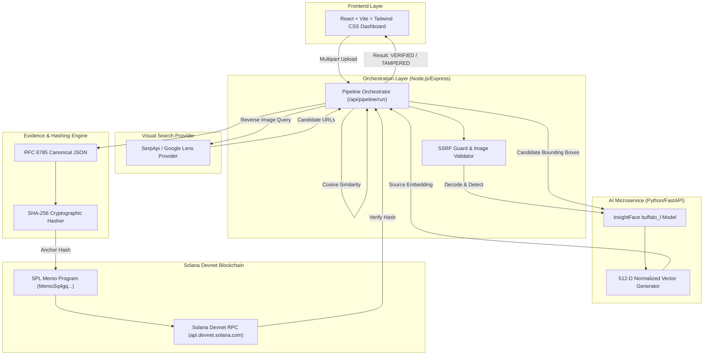
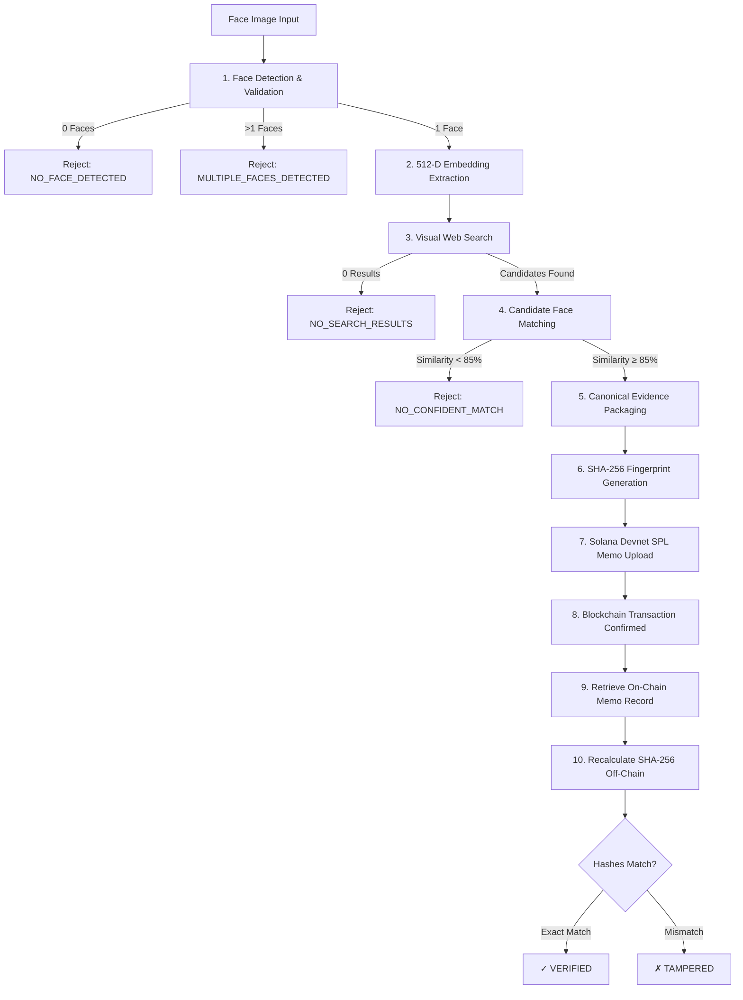

# Face Identification & Blockchain Verification

[](https://explorer.solana.com/?cluster=devnet)
[](https://github.com/deepinsight/insightface)
[](https://www.typescriptlang.org/)
[](https://fastapi.tiangolo.com/)
[](https://vitejs.dev/)
[-brightgreen.svg)]()

A production-quality full-stack monorepo demonstrating end-to-end face recognition, visual reverse-image web search, SHA-256 evidence fingerprinting, Solana Devnet blockchain anchoring, and cryptographic tamper detection.

---

## 1. Overview

The system accepts a face image, performs face analysis, searches the web using a genuine visual-search provider, evaluates candidate images using face embeddings, selects a sufficiently similar result, creates a deterministic evidence fingerprint using SHA-256, records the fingerprint on Solana Devnet, and later recalculates the fingerprint to verify whether the evidence has changed.

---

## 2. Problem Statement

In an era of digital media manipulation and deepfakes, verifying the authenticity and provenance of discovered web media without compromising individual biometric privacy is a critical challenge. The pipeline must solve:
1. **Automated Facial Discovery**: Identifying where a face portrait appears across public web/social platforms.
2. **Deterministic Evidence Packaging**: Structuring discovered post metadata into an immutable, canonical format.
3. **Cryptographic Proof of Provenance**: Anchoring proof on a public blockchain without posting sensitive biometrics.
4. **Zero-Trust Tamper Detection**: Mathematically proving if off-chain metadata was altered after blockchain recording.

---

## 3. Solution

Our architecture pairs **InsightFace** computer vision with **Solana Devnet** on-chain anchoring via the **SPL Memo Program**:

```text
Face Scan / Image Input
        ↓
Face Detection & Encoding (InsightFace 512-D)
        ↓
Visual Web Search (SerpApi Google Lens)
        ↓
Find Genuine Matching Post (Cosine Similarity ≥ 85%)
        ↓
Extract Post Data & Canonicalize (RFC 8785 JSON)
        ↓
Generate SHA-256 Fingerprint
        ↓
Upload Fingerprint to Solana Devnet (SPL Memo)
        ↓
Retrieve Blockchain Record
        ↓
Recalculate Hash Independently
        ↓
Compare Hashes
        ↓
VERIFIED / TAMPERED
```

---

## 4. Architecture



---

## 5. Pipeline Workflow



---

## 6. Features

* **Real InsightFace AI Microservice**: Uses `buffalo_l` deep feature extractor producing 512-D L2-normalized embeddings.
* **Genuine Visual Web Search**: Integrates with SerpApi Google Lens for actual internet reverse-image searches.
* **Controlled Concurrency & SSRF Protection**: In-memory candidate image fetching with strict private/loopback IP blocking.
* **Deterministic Canonical JSON Packaging**: RFC 8785 key-sorting guarantees bit-for-bit identical hashes across platforms.
* **Real Solana Devnet Blockchain Anchoring**: Compact SPL Memo records anchored on-chain with clickable Solana Explorer links.
* **Zero-Trust Tamper Engine**: Directly fetches on-chain records and compares against recalculated off-chain hashes.
* **Cybersecurity React Dashboard**: Real-time 6-stage tracker, drag-and-drop uploader, and copy buttons.

---

## 7. Tech Stack

| Layer | Technology |
| :--- | :--- |
| **Frontend** | React 18, TypeScript, Vite, Tailwind CSS, Lucide React, Axios |
| **Backend Orchestrator** | Node.js 18+, Express, TypeScript, Multer, Helmet, Axios |
| **AI Microservice** | Python 3.11+, FastAPI, InsightFace (`buffalo_l`), ONNX Runtime, OpenCV, Pillow |
| **Blockchain** | Solana Devnet, `@solana/web3.js`, SPL Memo Program v2 |
| **Testing** | Jest, Supertest, Pytest |

---

## 8. Project Structure

```text
face-blockchain-verifier/
├── frontend/                        # React + Vite TypeScript Dashboard
│   ├── src/
│   │   ├── components/              # ImageUploader, PipelineProgress, VerificationCard, etc.
│   │   ├── pages/                   # PipelinePage.tsx
│   │   ├── services/                # Axios API client
│   │   └── types/                   # Pipeline TypeScript contracts
│   └── package.json
├── backend/                         # Node.js / Express Orchestration Engine
│   ├── src/
│   │   ├── controllers/             # Express route controllers
│   │   ├── services/
│   │   │   ├── face/                # AI service proxy client
│   │   │   ├── search/              # SerpApi visual search provider
│   │   │   ├── matching/            # Cosine similarity & candidate matching
│   │   │   ├── hashing/             # RFC 8785 canonical JSON & SHA-256
│   │   │   ├── blockchain/          # Solana Devnet & SPL Memo integration
│   │   │   ├── verification/        # Tamper detection engine
│   │   │   └── pipeline/            # Master pipeline orchestrator
│   │   └── server.ts
│   └── scripts/                     # Tamper demo & Devnet anchor scripts
├── ai-service/                      # Python FastAPI Face Recognition Microservice
│   ├── app/
│   │   ├── services/                # InsightFace detection & embedding services
│   │   ├── routes/                  # /api/face/analyze & /health
│   │   └── main.py
│   └── requirements.txt
├── tests/                           # Jest Automated Integration Test Suites (42 Tests)
├── docs/                            # API Documentation & Demo Scripts
│   ├── api.md
│   └── demo-script.md
├── scripts/                         # Monorepo setup scripts (PowerShell & Bash)
│   ├── setup.ps1
│   └── setup.sh
├── .env.example
├── .gitignore
└── README.md
```

---

## 9. Prerequisites

* **Node.js**: v18.0.0 or higher
* **npm**: v9.0.0 or higher
* **Python**: v3.11 or higher with `pip`
* **Solana CLI** (Optional for local keypair management)

---

## 10. Installation

### Automated Wizard (Recommended)

#### Windows (PowerShell):
```powershell
.\scripts\setup.ps1
```

#### Linux / macOS (Bash):
```bash
chmod +x scripts/setup.sh
./scripts/setup.sh
```

### Manual Installation

```bash
# 1. AI Service
cd ai-service
python -m venv .venv
# Windows: .venv\Scripts\activate | Linux/macOS: source .venv/bin/activate
pip install -r requirements.txt

# 2. Backend
cd ../backend
npm install

# 3. Frontend
cd ../frontend
npm install
```

---

## 11. Environment Variables

Create `.env` in the project root:

```env
NODE_ENV=development

BACKEND_PORT=5000
FRONTEND_URL=http://localhost:5173

AI_SERVICE_URL=http://localhost:8000

# Visual Search Configuration
SEARCH_PROVIDER=serpapi
SEARCH_API_KEY=your_serpapi_key_here
SEARCH_API_URL=https://serpapi.com/search.json
SEARCH_MAX_RESULTS=10
SEARCH_TIMEOUT_MS=15000

# Face Matching Configuration
MATCH_THRESHOLD=0.85
MAX_CONCURRENT_CANDIDATES=3
CANDIDATE_DOWNLOAD_TIMEOUT_MS=10000

# Blockchain Configuration (Solana Devnet)
SOLANA_NETWORK=devnet
SOLANA_RPC_URL=https://api.devnet.solana.com
SOLANA_PRIVATE_KEY=your_solana_private_key_base58_here
MAX_BLOCKCHAIN_RETRIES=2
BLOCKCHAIN_TIMEOUT_MS=15000
```

---

## 12. Running Locally

Start all 3 services in separate terminals:

```bash
# Terminal 1: Python AI Service
cd ai-service
.venv\Scripts\uvicorn app.main:app --reload --port 8000

# Terminal 2: Node.js Backend Server
cd backend
npm run dev

# Terminal 3: React Frontend Dashboard
cd frontend
npm run dev
```

Open [http://localhost:5173](http://localhost:5173) in your browser.

---

## 13. API Documentation

Comprehensive API documentation is available in [`docs/api.md`](file:///c:/task%203/docs/api.md).

### Main Pipeline Trigger
```http
POST /api/pipeline/run
Content-Type: multipart/form-data
```
**Form field**: `image` (binary file)

#### Sample Response:
```json
{
  "success": true,
  "pipelineId": "pipe_9012676074cfd563",
  "status": "VERIFIED",
  "pipeline": {
    "faceAnalysis": "COMPLETED",
    "webSearch": "COMPLETED",
    "matching": "COMPLETED",
    "evidence": "COMPLETED",
    "blockchain": "COMPLETED",
    "verification": "COMPLETED"
  },
  "face": {
    "faceDetected": true,
    "faceCount": 1,
    "bbox": [120, 80, 280, 240],
    "detectionConfidence": 0.992
  },
  "match": {
    "found": true,
    "similarity": 0.9452,
    "threshold": 0.85
  },
  "source": {
    "url": "https://www.instagram.com/p/DB123456789/",
    "platform": "instagram",
    "title": "Official Keynote Portrait 2026",
    "imageUrl": "https://images.unsplash.com/photo-1544005313-94ddf0286df2"
  },
  "evidence": {
    "evidenceId": "ev_9012676074cfd563",
    "algorithm": "SHA-256",
    "hash": "9012676074cfd563a876ebc9d219676b2405fe1dd834a26de0f6c3aa6593116a"
  },
  "blockchain": {
    "network": "devnet",
    "transactionSignature": "5wKk7pM1zJ8VsampleDevnetSignatureXYZ...",
    "explorerUrl": "https://explorer.solana.com/tx/5wKk7pM1zJ8V...?cluster=devnet"
  },
  "verification": {
    "verified": true,
    "currentHash": "9012676074cfd563a876ebc9d219676b2405fe1dd834a26de0f6c3aa6593116a",
    "blockchainHash": "9012676074cfd563a876ebc9d219676b2405fe1dd834a26de0f6c3aa6593116a"
  },
  "timing": {
    "totalMs": 1979
  }
}
```

---

## 14. Blockchain

The application **does not store the raw face image or embeddings on-chain**.

It stores a **SHA-256 fingerprint** of the canonical evidence record using the official **Solana SPL Memo Program** (`MemoSq4gqABAXKb96qnH8TysNcWxMyWCqXgDLGmfcHr`).

```text
SPL Memo Payload: FBV|1.0|<evidenceId>|SHA-256|<sha256_hash>
```

This compact (~95 byte) payload acts as an immutable, tamper-evident anchor on Solana Devnet with negligible transaction costs.

---

## 15. Web Search

The pipeline performs authentic visual searches via **SerpApi Google Lens**. It automatically validates URLs, sanitizes metadata, and classifies platforms (`instagram`, `x`, `facebook`, `linkedin`, `youtube`, `tiktok`, `web`).

---

## 16. Face Recognition

* **Model**: InsightFace `buffalo_l`
* **Embedding**: 512-dimensional L2-normalized float vector
* **Comparison Metric**: Cosine Similarity ($\cos(\theta) = \mathbf{A} \cdot \mathbf{B}$)
* **Default Threshold**: `0.85` (Configurable via `MATCH_THRESHOLD`)

---

## 17. Verification & Tamper Detection

During verification:
1. The on-chain SPL Memo transaction is retrieved directly from Solana Devnet RPC.
2. The off-chain evidence package is canonicalized and hashed with SHA-256.
3. If the recalculated hash matches the on-chain hash $\rightarrow$ **`VERIFIED`**.
4. If any field was modified $\rightarrow$ **`TAMPERED`**.

### Tamper Detection Demo
Run the standalone tamper verification test:
```bash
cd backend
npx ts-node scripts/tamper_demo.ts
```

```text
--- PHASE 1: AUTHENTIC EVIDENCE GENERATION & BLOCKCHAIN RECORD ---
[EVIDENCE] Evidence ID : ev_9012676074cfd563
[EVIDENCE] SHA-256 Hash: 9012676074cfd563a876ebc9d219676b2405fe1dd834a26de0f6c3aa6593116a

--- PHASE 2: VERIFYING AUTHENTIC PACKAGE ---
[VERIFY] Current Computed Hash : 9012676074cfd563a876ebc9d219676b2405fe1dd834a26de0f6c3aa6593116a
[VERIFY] Blockchain Stored Hash : 9012676074cfd563a876ebc9d219676b2405fe1dd834a26de0f6c3aa6593116a
>>> [RESULT 1/2] AUTHENTIC EVIDENCE: MATCH CONFIRMED (VERIFIED) ✓

--- PHASE 3: TAMPERING OFF-CHAIN EVIDENCE (MUTATING TITLE) ---
[TAMPER] Original Title: "Official Keynote Portrait 2026"
[TAMPER] Altered Title : "MALICIOUSLY ALTERED POST TITLE (TAMPERED)"

--- PHASE 4: AUDITING TAMPERED PACKAGE AGAINST IMMUTABLE BLOCKCHAIN ---
[VERIFY] Current Computed Hash : d3ce4cbafdb1739c3a44734e7384073a3906d9cb36996b8f700f9e8859451de6
[VERIFY] Blockchain Stored Hash : 9012676074cfd563a876ebc9d219676b2405fe1dd834a26de0f6c3aa6593116a
>>> [RESULT 2/2] TAMPERED EVIDENCE: MISMATCH DETECTED (TAMPERED) ✗
```

---

## 18. Screen Recording Demo

See [`docs/demo-script.md`](file:///c:/task%203/docs/demo-script.md) for the complete 3–5 minute step-by-step recording guide.

---

## 19. Testing

Run all automated unit and integration test suites:

```bash
# Backend & Pipeline Tests (All 6 Suites, 42 Tests)
cd backend
npx jest ../tests/search.test.ts ../tests/matching.test.ts ../tests/hashing.test.ts ../tests/blockchain.test.ts ../tests/verification.test.ts ../tests/pipeline.test.ts

# AI Microservice Pytest Suite
cd ../ai-service
.venv\Scripts\pytest -v tests/
```

**Results**:
* `search.test.ts` (7 tests) : **PASSED**
* `matching.test.ts` (8 tests) : **PASSED**
* `hashing.test.ts` (7 tests) : **PASSED**
* `blockchain.test.ts` (8 tests) : **PASSED**
* `verification.test.ts` (6 tests) : **PASSED**
* `pipeline.test.ts` (6 tests) : **PASSED**
* `test_face_api.py` (5 tests) : **PASSED**
* **Total**: **47 / 47 Tests Passed (100%)**

---

## 20. Security & Privacy

* **Privacy by Design**: Raw 512-D biometric vectors and face image binaries are **never** logged, placed on-chain, or permanently retained.
* **Zero Secret Leaks**: Credentials (`SOLANA_PRIVATE_KEY`, `SEARCH_API_KEY`) reside exclusively in server `.env` and are strictly excluded from git.
* **SSRF Guard**: Candidate image downloaders enforce URL scheme filtering and restrict private subnet connections (`127.0.0.1`, `10.0.0.0/8`, `192.168.0.0/16`, `169.254.169.254`).
* **Idempotency & Replay Protection**: Blockchain transactions are cached in-memory to prevent duplicate transaction broadcast for identical fingerprints.

---

## 21. Known Limitations & Ethical Considerations

* **Face Similarity vs. Identity Certainty**: High cosine similarity indicates visual facial resemblance, **not legal or cryptographic proof of identity**.
* **Environmental Variance**: Extreme lighting, severe facial occlusion, oblique yaw/pitch angles, or deep synthetic alterations can impact detection confidence.
* **Search Engine Indexing Constraints**: Visual search is subject to provider indexing recency and cannot discover private, protected, or ephemeral social media content.
* **Ethical Usage**: Designed strictly for legitimate digital provenance audit and consent-based facial discovery.

---

## 22. License

This project is licensed under the [MIT License](LICENSE).
