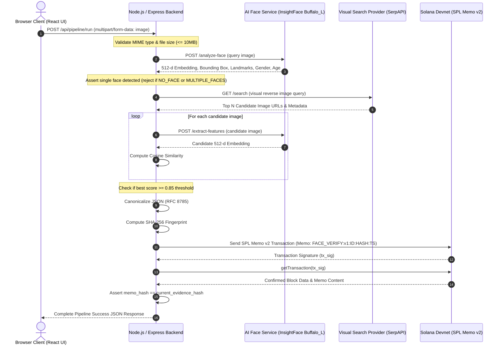

# End-to-End Architecture Flow

This document details the request flow and architectural interactions across all pipeline stages.

## Mermaid Sequence Diagram

## Stage Responsibilities

| Stage | Service / Module | Key Output |
|---|---|---|
| **Stage 1: Face Analysis** | Python AI Service | 512-d Face Embedding |
| **Stage 2: Visual Search** | Search Service | Candidate URLs list |
| **Stage 3: Face Matching** | Matching Service | Match Result & Cosine Score |
| **Stage 4: Evidence Hashing** | Hashing Service | SHA-256 Canonical Fingerprint |
| **Stage 5: Blockchain Anchor** | Solana Web3 Service | Solana Transaction Signature |
| **Stage 6: Verification** | Verification Service | Cryptographic Audit Proof |
