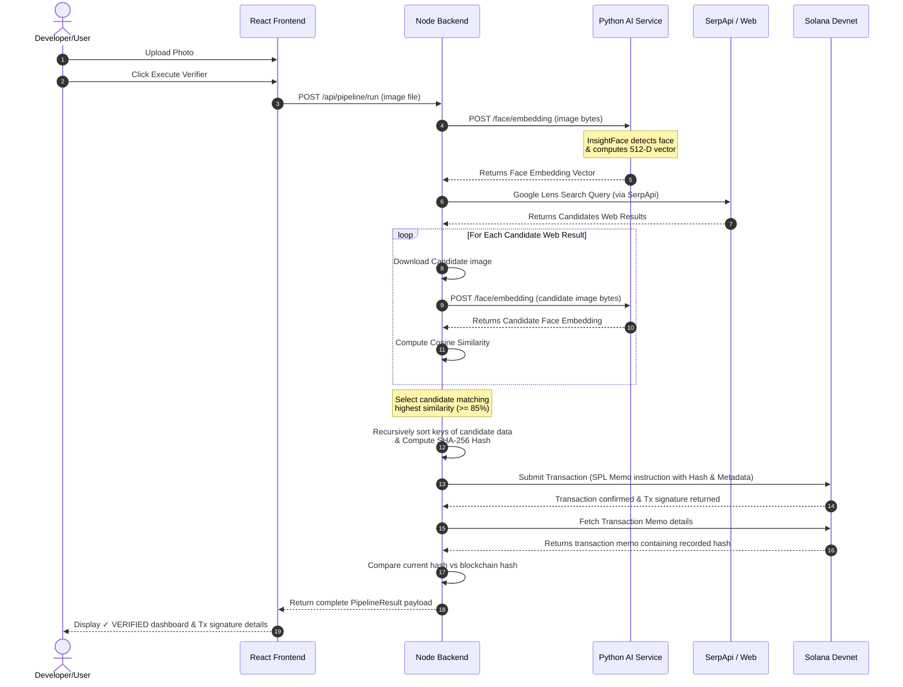

# System Architecture

This document describes the architectural layout, components, and data flow of the **Face Identification & Solana Blockchain Verification Pipeline**.

---

## 1. Directory Overview

The project is structured as a monorepo containing three core packages:

```text
├── frontend/             # React + Vite + TypeScript (UI dashboard)
├── backend/              # Node.js + Express + TypeScript (Orchestration API)
├── ai-service/           # FastAPI + Python (InsightFace model inference)
├── scripts/              # Windows PowerShell and Linux installation files
├── docs/                 # System architecture and API files
└── tests/                # Jest Hashing, Blockchain, and API test suites
```

---

## 2. Component Design & Roles

### 2.1. React Client UI (`frontend/`)
The frontend is a React application built with TypeScript and styled with a dark, security-focused layout.
* **Dashboard Page**: Displays system service diagnostic checks (diagnosing FastAPI loading state and Solana account status).
* **Pipeline Page**: Provides an interactive image upload drag-zone, displays a live chronological pipeline step-trace, displays visual card lists of matches, outputs SHA-256 fingerprints, shows Solana signatures, and highlights verification results.
* **Tamper Simulation Sandbox**: Allows developers to modify input fields on the matched post, re-evaluate hash signatures, and observe the red `✗ TAMPERED` alert banner.

### 2.2. Node.js Backend Orchestrator (`backend/`)
Built with Express.js and TypeScript, the backend functions as the main controller.
* **FaceService**: Interfaces with the FastAPI service to send images and retrieve facial bounding boxes and 512-dimensional embeddings.
* **SearchService**: Integrates with SerpApi Google Lens engine to search for matching profiles online.
* **MatchingService**: Downloads candidate image matches, extracts their face embeddings, calculates the **Cosine Similarity**, and identifies the best match above the threshold (default: `0.85`).
* **HashingService**: Serializes matched candidate JSON structures deterministically (sorting keys recursively) and computes standard SHA-256 signatures.
* **BlockchainService**: Connects to Solana Devnet, auto-funds new wallets using airdrops, submits fingerprints using SPL Memo instructions, and fetches recorded data by signature.

### 2.3. Python AI Engine (`ai-service/`)
A Python service wrapped in a FastAPI container.
* **FastAPI**: Receives uploaded images and manages requests.
* **InsightFace**: Loads the pre-trained `buffalo_l` model pack containing ArcFace and RetinaFace models. Extractor builds a 512-dimensional float array matching face features.
* **OpenCV**: Converts incoming raw image bytes into standard BGR matrix matrices for machine learning evaluation.

---

## 3. Data Flow & Transaction Lifecycle


